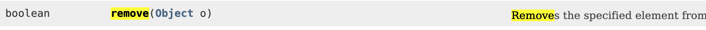
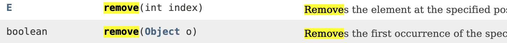
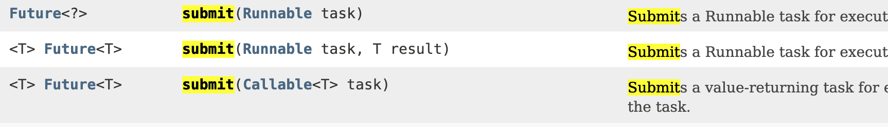
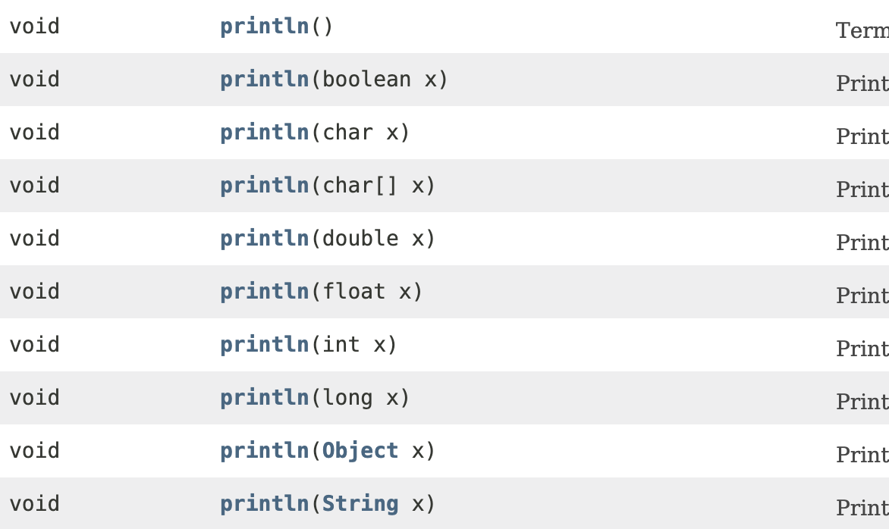

# Item 52 - 다중정의는 신중히 사용하라

## 다중정의의 문제점

```java
package effectivejava.chapter8.item52;
import java.util.*;
import java.math.*;

// 코드 52-1 컬렉션 분류기 - 오류! 이 프로그램은 무엇을 출력할까? (312쪽)
public class CollectionClassifier {
    public static String classify(Set<?> s) {
        return "집합";
    }

    public static String classify(List<?> lst) {
        return "리스트";
    }

    public static String classify(Collection<?> c) {
        return "그 외";
    }

    public static void main(String[] args) {
        Collection<?>[] collections = {
                new HashSet<String>(),
                new ArrayList<BigInteger>(),
                new HashMap<String, String>().values()
        };

        for (Collection<?> c : collections)
            System.out.println(classify(c));
    }
```

위 코드의 결과는 "그 외" 만 세번 연달아 나오게 된다.

→ 개발자의 의도는 집합 리스트 "그 외" 였는데 왜 이렇게 나오게 된걸까? 

바로 **다중정의 된 메소드 중 어느 메서드를 호출할지가 컴파일타임에 정해지기 때문**이다!!

```java
for (Collection<?> c : collections)
            System.out.println(classify(c));
```

이 코드 부분에서 `c` 는 항상 `Collection<?>` 타입으로 컴파일 되어 컴파일 타임의 매개변수 타입을 기준으로 항상 세번째 메서드를 호출 하게 된다.

여기서 의문점을 가질 수 있는데 **재정의한 메서드**와 **다중정의한 메서드**는 뭐가 다른것일까?

→ 재정의한 메서드 = 동적으로 선택

→ 다중정의한 메서드 = 정적으로 선택

```java
class Wine {
    String name() { return "포도주"; }
}

class SparklingWine extends Wine {
    @Override String name() { return "발포성 포도주"; }
}

class Champagne extends Wine {
    @Override String name() { return "샴페인"; }
}
```

재정의한 메서드는 **해당 객체의 런타임 타입이 어떤 메서드를 호출할지 기준**

컴파일타임 타입이 모두 `Wine` 이지만 런타임에서는 이와 무관하게 항상 가장 하위에 정의한 재정의 메서드 실행된다.

→ 다중정의된 메서드 사이에서는 객체의 런타임 타입은 중요하지 않음!!

- **선택은 오직 컴파일 타임 타입에 의해 이뤄진다,,**

    → **하지만 런타임에는 항상 타입이 달라지는데 이 부분을 해결해야 한다!**

# 다중정의 문제점 해결책

```java
public static String classify(Collection<?> c){
	return c instanceof Set ? "집합" :
				 c instanceof List ? "리스트" : "그 외";
}
```

→ `instanceOf` 로 명시적 검사 하기!

```java
writeBoolean(boolean)
writeInt(int)
writeLong(long)
```

→ 다중정의 대신 메서드이름을 다르게 지어주기

- 다중정의보다 나은 점은 `read` 메서드의 이름과 짝 맞추기 좋다!

하지만 최고의 해결책은 **헷갈릴 수 있는 코드는 작성하지 않고 다중정의가 혼동을 일으키는 상황을 피하는 것**!

- 매개변수 수가 같은 다중정의X
- 가변인수를 사용하는 메서드라면 다중정의X

# 생성자의 다중정의 문제점

→ 생성자는 이름을 다르게 지을수가 없다!

두 번째 생성자부터는 무조건 다중정의가 되는데 이를 해결할 방법은?

→ **정적 팩터리 대안 활용**

# 생성자의 다중정의 문제점 해결책

→ 생성자는 재정의할 수 없어 다중정의와 재정의 혼용 가능성 ZERO

매개변수 중 하나 이상이 근본적으로 다를 시( 두 타입의 값을 서로 어느쪽으로든 형변환 X) 다중정의로 인한 혼동 없음!!

→ 어느 다중정의 메서드를 호출할지가 매개변수들의 런타임 타입으로 결정된다

이렇게 된다면 컴파일타임 타입에는 영향을 받지 않고 런타입 타입에 타입 결정~

- ex ) `ArrayList`의 `int` 생성자와 `Collection` 생성자 → 서로 혼돈 불가!

## 그래도 문제가 발생한다고? - 1(오토박싱)

→ 자바 5에서 **오토박싱**이 도입되면서 문제가 다시 발생하기 시작

```java
import java.util.*;

public class SetList {
    public static void main(String[] args) {
        Set<Integer> set = new TreeSet<>();
        List<Integer> list = new ArrayList<>();

        for (int i = -3; i < 3; i++) {
            set.add(i);
            list.add(i);
        }
        for (int i = 0; i < 3; i++) {
            set.remove(i);
            list.remove(i);
        }
        System.out.println(set + " " + list);
    }
}
```

- `set.remove`
    - 정상적으로 출력된다.



- `list.remove`
    - 정상적으로 출력이 안된다.



        → `remove` 메서드가 다중정의 되어 `remove(int)`를 호출하기 때문이다.

### 문제 해결 방법

```java
for (int i = 0; i < 3; i++) {
    set.remove(i);
    list.remove((Integer) i);
}
```

→ `Arraylist.remove(Obejct)`를 호출하기 위해 **형변환**를 해준다!

## 그래도 문제가 발생한다고? - 2(람다와 메서드 참조)

→ 자바 8의 **람다**와 **메서드 참조**로 인한 문제가 또 다시 발생하기 시작

```java
//1번 정상작동
new Thread(System.out::println).start();

//2번 컴파일 오류
ExecutorService exec = Executors.newCachedThreadPool();
exec.submit(System.out::println);
```

2번 컴파일 오류의 원인은 `submit` 메서드의 다중정의



`submit(Callalbe<T>)`을 주의깊게 보자

근데 의문점은 모든 `println` 메서드는 `void`를 반환하니 `Callable`과 헷갈릴 리 없지 않을까?

→ 아니다! **합리적인 추론은 맞지만 다중정의 해소는 이렇게 동작X**

- `println`



- `submit`


→ **두 메서드가 다중정의 되어 다중정의 해소 알고리즘이 우리의 기대처럼 동작X**

다중정의 해소 알고리즘이 우리의 기대처럼 동작하지 않는 이유를 기술적으로 말하면

**부정확한 메서드 참조, 암시적 타입 람다식 같은 *인수 표현식*은 목표 타입이 선택되기 전 그 의미가 정해지지 않아 적용성 태스트 때 무시되는 것!**

### 해결책

메서드를 다중정의할 때, 서로 다른 함수형 인터페이스라도 같은 위치의 인수로 받아서는 안 된다.

→ 서로 다른 함수형 인터페이스는 서로 근본적으로 다르지 않다를 기억하자!

### 더 나아가보자! 근본적으로 다른 것들은?

- 클래스 타입 / 배열 타입
- Serializable 과 Cloneable 외의 인터페이스 타입 / 배열 타입
- 상위/하위 관계가 아닌 두 클래스 → 관련없다.
- 어떤 객체도 관련 없는 두 클래스 → 관련 없다.

→ 관련 없는 클래스들끼리도 근본적으로 다르다.

# 그래도 다중정의를 사용한다면...

다중정의된 메서드 중 하나를 선택하는 규칙 매우 복잡하지만 사용한다면...

어떤 다중정의 메서드가 불리는지 몰라도 기능을 똑같이 만들어 신경을 쓰지 않게 하자

```java
public boolean contentEquals(StringBuffer sb) {
	return contentEquals((CharSequence) sb);
}
```

→ 인수를 포워드하여 두 메서드가 동일한 일을 하다록 보장한다.

# 결론

다중정의를 꼭 활용X

- 매개변수 수가 같을 때는 다중정의 피하기
- 헷갈릴 만한 매개변수는 형변환 하여 정확한 다중정의 메서드가 선택되도록 하자
- 같은 객체를 입력받는 다중정의 메서드들이 모두 동일하게 동작하도록 하자
