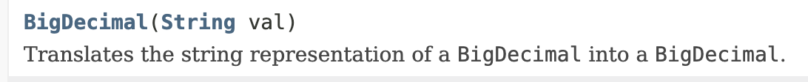

# Item 60 - 정확한 답이 필요하다면 float와 double을 피하라

# float 와 double의 치명적 단점?

본래  `float`와 `double` 타입은 과학과 공학 계산용으로 설계되었습니다. 즉, 넓은 범위의 수를 빠르게 정밀한 근사치로 계산하도록 설계된 것이지요. 

따라서 정확한 결과가 필요한 연산에서는 사용하면 안 됩니다.

특히, 금융 관련 계산에서 주의 해야 합니다. 0.1 혹은 10의 음의 거듭 제곱 수 등을 표현할 수 없기 때문입니다.

예를 들어

```java
public static void main(String[] args) {
    double funds = 1.00;
    int itemsBought = 0;
    for (double price = 0.10; funds >= price; price += 0.10) {
        funds -= price;
        itemsBought++;
    }
    System.out.println(itemsBought + " items bought.");
    System.out.println("Change: $" + funds);
}
```

이런 식의 계산을 실행했을 때에 잘못된 결과가 나오게 됩니다.

🤔그럼 어떻게 계산을 해야 할까요?

# `BigDecimal` `int` `long` 의 금융 계산

금융 계산에는 `BigDecimal`, `int` 혹은 `long`을 사용해야 합니다.

## 1. `BigDecimal` 사용

앞의 예를 `BigDecimal`을 사용해 다시 보자면

```java
ublic static void main(String[] args) {
        final BigDecimal TEN_CENTS = new BigDecimal(".10");

        int itemsBought = 0;
        BigDecimal funds = new BigDecimal("1.00");
        for (BigDecimal price = TEN_CENTS;
             funds.compareTo(price) >= 0;
             price = price.add(TEN_CENTS)) {
            funds = funds.subtract(price);
            itemsBought++;
        }
        System.out.println(itemsBought + " items bought.");
        System.out.println("Money left over: $" + funds);
    }
```

`BigDecimal`의 생성자 중 문자열을 받는 생성자를 이용해서 계산 시 부정확한 값이 사용되는 걸 방지했습니다.



하지만 `BigDecimal`은 단점이 존재합니다.

- 기본 타입보다 쓰기가 훨씬 불편합니다.
- 기본 타입보다 훨씬 느립니다.

→ 이러한 단점이 단발성 계산이라면 무시가 가능하지만 문제가 될 수 있습니다. 

그래서  `BigDecimal` 의 대안으로 `int` `long` 타입을 사용할 수 있습니다.

## 2. `int` 사용

`BigDecimal`  의 대안으로 int long을 사용할 시 값의 크기가 제한되고, 소수점을 직접 관리해야 한다는 불편함이 있습니다.

```java
public static void main(String[] args) {
    int itemsBought = 0;
    int funds = 100;
    for (int price = 10; funds >= price; price += 10) {
        funds -= price;
        itemsBought++;
    }
    System.out.println(itemsBought + " items bought.");
    System.out.println("Cash left over: " + funds + " cents");
}
```

# 정리

- 정확한 답이 필요한 계산에는 `float`나 `double`은 피해야 합니다.
- `BigDecimal`을 사용할 때는 성능저하를 주의해야 합니다. 대신 `BigDecimal`이 제공하는 여덞 가지 반올림 모드를 이용해 반올림을 완벽히 제어할 수 있습니다.
- 숫자를 아홉 자리 십진수 표현 : `int`
- 숫자를 열여덟 자리 십진수 표현 : `long`
- 숫자를 열여덞 자리 넘어가는 십진수 표현 : `BigDecimal`