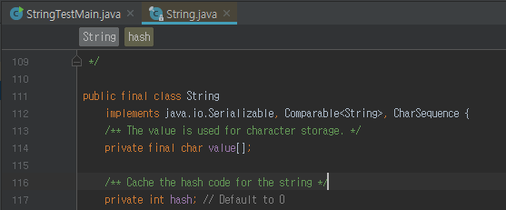
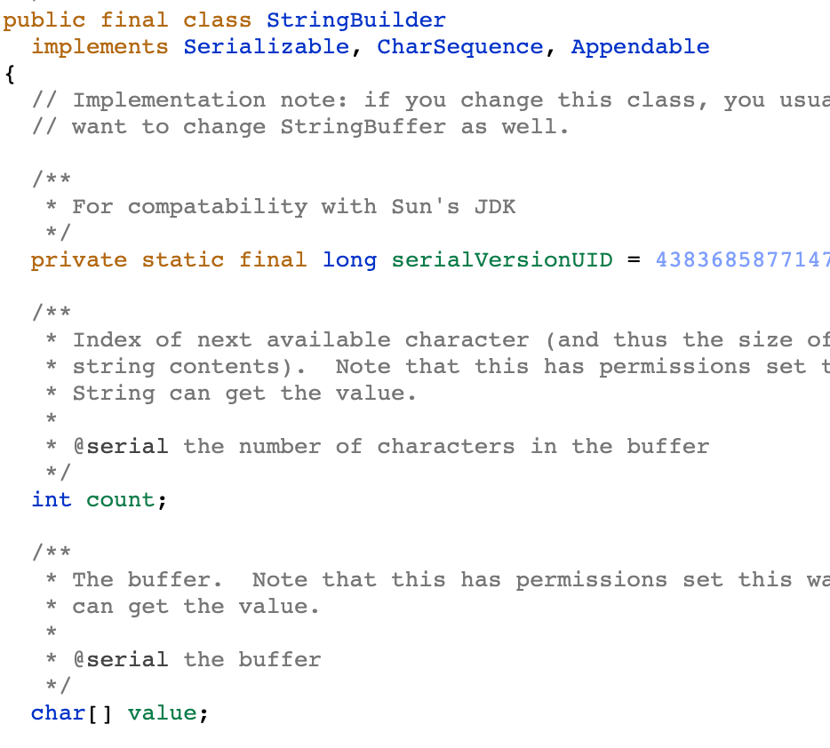

# Item 63 - 문자열 연결은 느리니 주의하라

# 문자열 연결 연산자(+)

문자열 연결 연산자(+)는 여러 문자열을 하나로 합쳐주는 편리한 수단입니다.

하지만 성능 저하를 감내하기 어려울 수도 있습니다. 

문자열 연결 연사자로 문자열 n개를 잇는 시간은 n제곱에 비례하기 때문입니다.

🤔  왜 문자열 연결 연사자를 사용하게 되면 성능 저하가 발생할까요?

바로, 문자열은 불변이라서 두 문자열을 연결할 경우 양쪽의 내용 모두 복사해야 하므로 성능 저하가 발생합니다.

🤔 그럼 어떻게 문자열을 연결해야 할까요?

성능을 포기하고 싶지 않다면 `String` 대신 `StringBuilder`를 사용하면 됩니다.

`String`

`StringBuilder`

위의 코드는 각 `String` 과 `StringBuilder`의 코드인데요 각 코드의 차이점이 보이시나요?

바로 `String` 에서는 `value`를 `private final char value[]` 로 선언을 해서 변경이 안되는 불변 객체이고 `StringBuilder`는 `char[] value` 로 선언을 해 변경이 가능합니다.

이 처럼 문자열 연결을 할 때는 `StringBuilder`를 사용하면 훨씬 성능이 좋아집니다. `StringBuilder`를 사용하고 싶지 않다면 문자열을 연결하지 않고 하나씩 처리하는 방법도 있습니다.